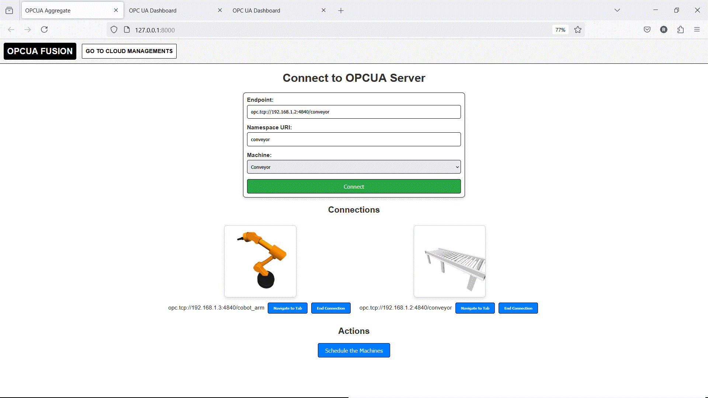

# OPCUA Fusion - OPC UA Client and Data Aggregator


OPCUA Fusion is a comprehensive Django-based web application designed to connect to, monitor, and interact with multiple OPC UA servers. It provides a real-time dashboard for each connected server, logs historical data to Google Firebase, enables complex process scheduling across machines, and offers tools for data visualization and download.

## 📸 User Interface Preview

<p align="center">
  
</p>

## ✨ Features

-   🌐 **Multi-Server Connectivity**: Connect to multiple OPC UA servers simultaneously from a central hub.
-   📊 **Real-time Dashboard**: For each connection, a dedicated dashboard provides:
    -   A hierarchical tree view of the server's address space.
    -   Detailed node information (ID, class, description, data type).
    -   Live monitoring of variable values, updated every 500ms.
-   ⚙️ **Method Execution**: Call methods on the OPC UA server directly from the web interface, with support for input arguments.
-   ☁️ **Cloud Data Logging**: All connection events, node structures, real-time variable data, and method calls are logged to **Google Firebase Firestore**, creating a historical data record.
-   🔗 **Process Scheduling & Aggregation**:
    -   Design and execute complex process chains involving method calls on different machines in a specific sequence.
    -   Use the output of one process step as an input for a subsequent step.
-   🎨 **Data Visualization**: Generate 2D plots of historical data stored in Firestore by selecting variables for the X and Y axes and specifying a time range.
-   💾 **Data Export**: Download historical variable data as a CSV file for a given time period.
-   🧊 **3D Machine Visualization**: The main hub displays an interactive 3D model (using Three.js) for each connected machine type (CNC, Cobot, Conveyor).

---

## 🛠️ Technology Stack

-   **🐍 Backend**: Django 5.0, Python 3.x
-   **🤝 OPC UA Communication**: `freeopcua/opcua` library
-   **🗄️ Database**:
    -   **Primary Data Store**: Google Firebase Firestore
    -   **Django Backend**: SQLite (default)
-   **🖥️ Frontend**: HTML, CSS, JavaScript (Vanilla)
-   **⚡ Asynchronous Tasks**: `asyncio`, `ThreadPoolExecutor`, and `threading` for non-blocking data collection and process execution.
-   **🧊 3D Rendering**: Three.js
-   **🐼 Data Handling & Plotting**: Pandas, Matplotlib

---

## ✅ Prerequisites

-   Python 3.10+
-   `pip` package manager
-   An active OPC UA Server for testing.
-   A Firebase project enabled.

---

## 🚀 Setup and Installation

Follow these steps to set up and run the project locally.

### 1. 🔥 Firebase Setup (Critical Step)

This project relies on Google Firebase to store all operational data.

1.  **Create a Firebase Project**:
    -   Go to the [Firebase Console](https://console.firebase.google.com/).
    -   Click "Add project" and follow the on-screen instructions.

2.  **Generate a Service Account Key**:
    -   In your Firebase project, go to **Project Settings** (click the gear icon ⚙️ next to "Project Overview").
    -   Navigate to the **Service accounts** tab.
    -   Click **Generate new private key**. A JSON file will be downloaded.
    -   **Rename this file to `serviceAccountKey.json`**.
    -   **Place this file in the root directory of the Django project** (the same folder that contains `manage.py`).

3.  **Set up Firestore Database**:
    -   In the Firebase Console, go to **Build > Firestore Database**.
    -   Click **Create database**.
    -   Start in **Test mode** for initial setup. This allows open read/write access.
    > ⚠️ **Security Note**: For production, you must configure [Security Rules](https://firebase.google.com/docs/firestore/security/get-started) to protect your data.
    -   Choose a location for your database.

4.  **Set up Firebase Storage**:
    -   The application uses a storage bucket name in the configuration.
    -   In the Firebase Console, go to **Build > Storage**.
    -   Click **Get started** and follow the setup wizard (you can use the default security rules for now).
    -   Once created, you will see your storage bucket URL at the top (e.g., `gs://my-project.appspot.com`).
    -   Open `opcua_client/views.py` and find this line:
        ```python
        firebase_admin.initialize_app(
            cred,
            {"storageBucket": "opcuafusion.appspot.com"}, # <-- CHANGE THIS
        )
        ```
    -   Replace `"opcuafusion.appspot.com"` with your actual bucket name (without the `gs://` prefix).

### 2. 💻 Project Installation

1.  **Clone the Repository**:
    ```bash
    git clone <your-repository-url>
    cd opcua_fusion
    ```

2.  **Create and Activate a Virtual Environment**:
    ```bash
    # For Windows
    python -m venv venv
    .\venv\Scripts\activate

    # For macOS/Linux
    python3 -m venv venv
    source venv/bin/activate
    ```

3.  **Install Dependencies**:
    ```bash
    pip install -r requirements.txt
    ```

4.  **Apply Database Migrations**:
    (This sets up the local SQLite database for Django's internal use)
    ```bash
    python manage.py migrate
    ```

5.  **Run the Development Server**:
    ```bash
    python manage.py runserver
    ```

The application will now be running at `http://127.0.0.1:8000/`.

---

## 📖 How to Use the Application

### 🌐 Main Hub: Connecting Machines

1.  Open your browser to `http://127.0.0.1:8000/`.
2.  In the form, enter:
    -   **Endpoint**: The URL of your OPC UA server.
    -   **Namespace URI**: The namespace identifier for your server's objects.
    -   **Machine**: Select a machine type (CNC, Cobot, etc.).
3.  Click **Connect**. A new browser tab will open with the dashboard for that machine.
4.  The main hub page will now show a 3D model of the connected machine. You can interact with the model and connect to more machines.

### 🖥️ Machine Dashboard

The new tab is the command center for a single machine.

-   **Address Space**: Browse the server's nodes. Click `▶` to expand. Click a node name to see its details.
-   **Display Panel**: Shows details of the last-clicked node and the results of method calls.
-   **Variables Real Time**: A live feed of all variable values from the server, refreshing automatically.
-   **Methods**: Lists all callable methods. Provide inputs and click **Run** to execute.
-   **Disconnect**: Click the "Disconnect" button or close the tab to end the session.

### 📈 Data Visualization and Download

On the machine dashboard, you will find two buttons:

-   **Generate Graph**: Opens a new tab to plot historical data from Firestore.
-   **Download Data**: Opens a new tab to download historical variable data as a CSV file.

### 🔗 Scheduling a Process Chain

Automate tasks across multiple connected machines.

1.  From the main hub, click **Schedule the Machines**.
2.  A new window opens. Enter the number of steps in your process.
3.  **Define the Chain**: For each step, select a machine and the method to call.
4.  **Provide Inputs**: For each step, provide static values or use the output from a previous step as input.
5.  **Schedule and Execute**: Start the process and monitor the live log. An **Emergency Stop** button is available.

## 🧪 Testing & Complementary Applications

-   **Test Environment**: The OPCUA Fusion application can be tested using a set of sample OPC UA servers and virtual hardware simulations available at: [opcua_fusion_test_servers_and_hardware](https://github.com/roshbeng/opcua_fusion_test_servers_and_hardware).
-   **Customer-Facing Application**: A complementary customer-facing cloud application that works with the data logged by OPCUA Fusion is available here: [opcua_fusion_cloud](https://github.com/roshbeng/opcua_fusion_cloud.git).
